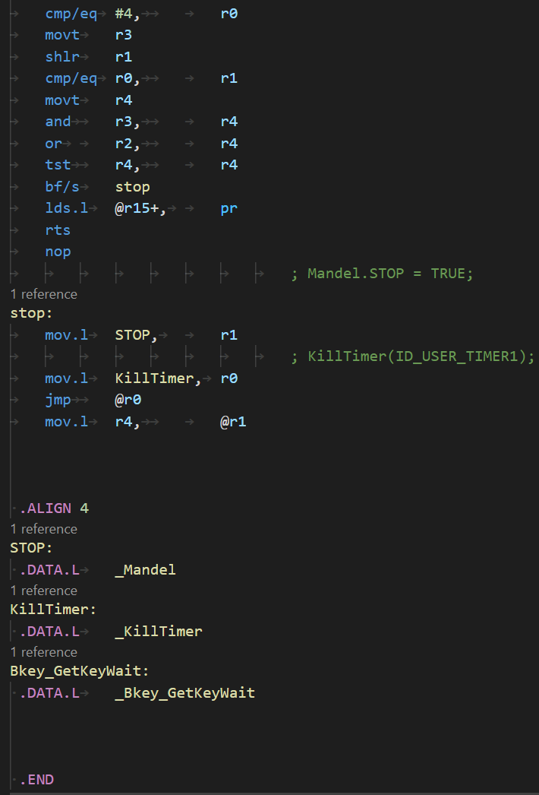

# Syntax Highlighting and Snippets for CASIO/Gint SuperH assembly language

## Features

Highlights CASIO/Gint specfic SuperH assembly language.  
To be used with the fx-9860Gii SDK.  
Also supports the SDK's .fsy and .lst debug files.  
All invalid/incorrect code is highlighted in red.  
Snippets!  
Ctrl+click definitions on labels  
Breadcrumbs  
Basic error detection (SDK only)  
  

## Requirements

This extension was designed with VSCode's default Dark+ theme in mind.  
Other themes may work with various successes.  

## Known Issues

Please make any \[Feature] requests or \[Bug] reports at https://github.com/RedCMD/CASIO-Gint-syntax-highlighter/issues

## Release Notes

Check out the change log.

### For more information

* [Planète CASIO](https://www.planet-casio.com/Fr) - French based site with English speakers
* [fx-9860Gii SDK](http://edu.casio.com/support/en/agreement.html#2) - Click accept, then scroll down the bottom to the fx-9860GII series
